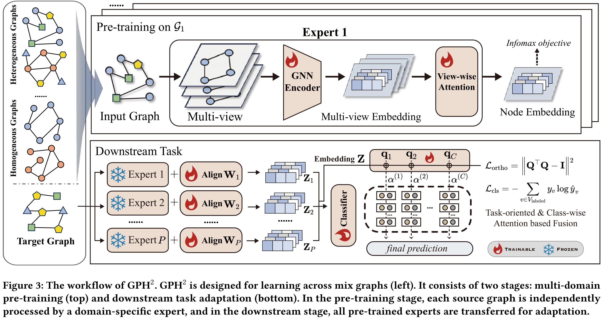

# Unified Multi-Domain Graph Pre-training for Homogeneous and Heterogeneous Graphs via Domain-Specific Expert Encoding

This is the official implementation of $\text{GPH}^{2}$:

> [Unified Multi-Domain Graph Pre-training for Homogeneous and Heterogeneous Graphs via Domain-Specific Expert Encoding](https://arxiv.org/abs/2602.13075)
>
> KDD 2026 Cycle 2 - Research track (accepted)

##  Abstract

Graph pre-training has achieved remarkable success in recent years, delivering transferable representations for downstream adaptation. However, most existing methods are designed for either homogeneous or heterogeneous graphs, thereby hindering unified graph modeling across diverse graph types. This separation contradicts real-world applications, where mixed homogeneous and heterogeneous graphs are ubiquitous, and distribution shifts between upstream pre-training and downstream deployment are common. In this paper, we empirically demonstrate that a balanced mixture of homogeneous and heterogeneous graph pre-training benefits downstream tasks and propose a unified multi-domain Graph Pre-training method across Homogeneous and Heterogeneous graphs ($\text{GPH}^{2}$). To address the lack of a unified encoder for homogeneous and heterogeneous graphs, we propose a Unified Multi-View Graph Construction that simultaneously encodes both without explicit graph-type-specific designs. To cope with the increased cross-domain distribution discrepancies arising from mixed graphs, we introduce domain-specific expert encoding. Each expert is independently pre-trained on a single graph to capture domain-specific knowledge, thereby shielding the pre-training encoder from the adverse effects of cross-domain discrepancies. For downstream tasks, we further design a Task-oriented Expert Fusion Strategy that adaptively integrates multiple experts based on their discriminative strengths. Extensive experiments on mixed graphs demonstrate that $\text{GPH}^{2}$ enables stable transfer across graph types and domains, significantly outperforming existing graph pre-training methods.


## Framework

---


## Getting Started

Change directory to `code` and run the following command for *cora* dataset:

`python down_task.py --data_name cora --encoders citeseer_pubmed_amazon-photo_amazon-computer --lr 0.01 --dropout 0.2 --num_layers 5`

The hyper-parameters of all datasets can be found in Table 7 of the paper.


##  Mainly Dependencies
- torch==2.8.0+cu128
- torch-geometric==2.7.0
 
## Citation

If you use this repository and find it useful, please cite our paper. Thanks! :)

```
@inproceedings{gph^2,
  title={Unified Multi-Domain Graph Pre-training for Homogeneous and Heterogeneous Graphs via Domain-Specific Expert Encoding},
  author={Liang, Chundong and Huang, Yongqi and He, Dongxiao and Li, Peiyuan and Li, Yawen and Jin, Di and Zhang, Weixiong},
  booktitle={Proceedings of the 32nd ACM SIGKDD Conference on Knowledge Discovery and Data Mining V.2 (KDD 2026)},
  pages={},
  year={2026}
}
```
